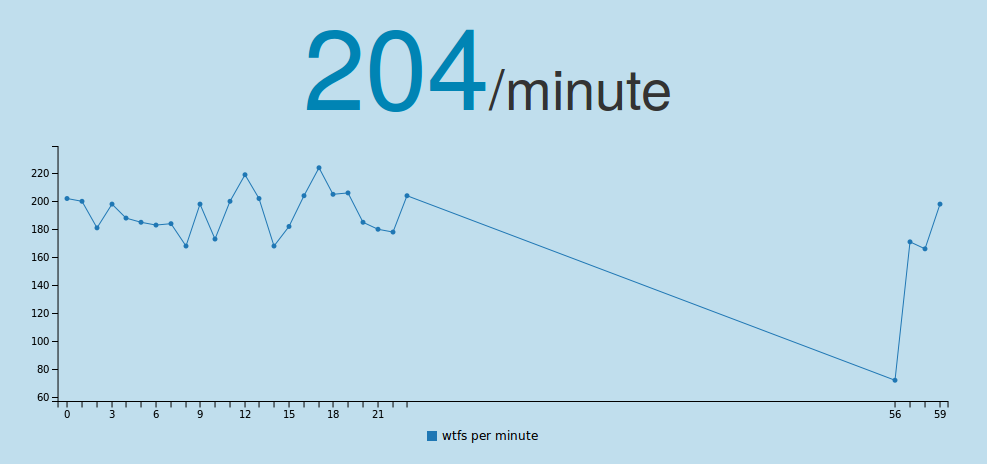

wtf-o-meter
===========

counts tweets with "wtf" in it. wtf/minute inspired by this:

## Installing
1. `virtualenv wtf-o-meter`
2. `git clone git@github.com:xsteadfastx/wtf-o-meter.git`
3. `cd wtf-o-meter`
4. `pip install -r requirements.txt`
5. `cd app`
6. `cp config.py.dist config.py && vim config.py`
7. `python app.py`  
